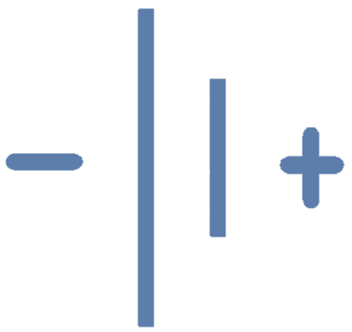
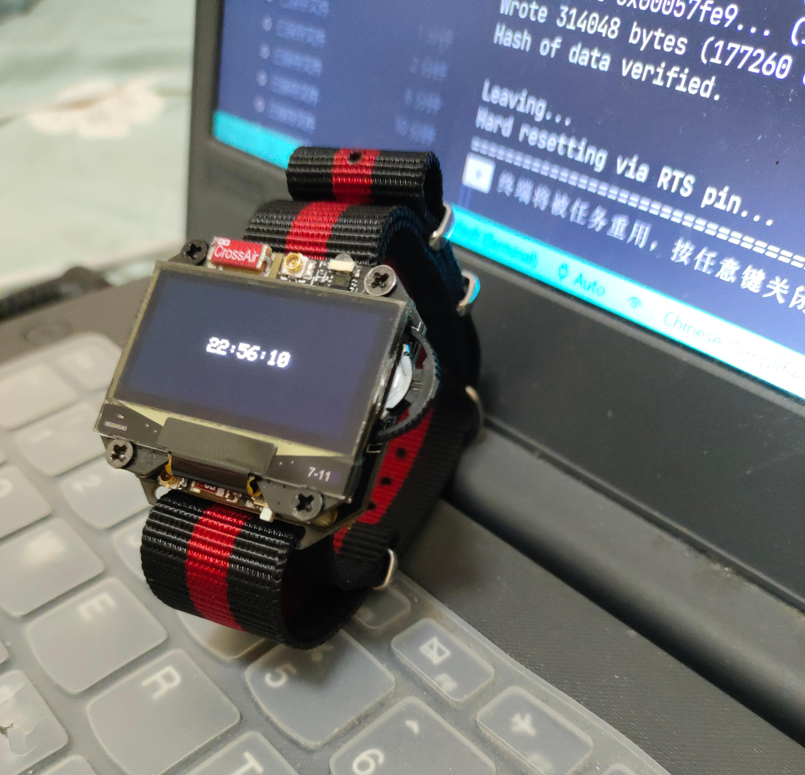
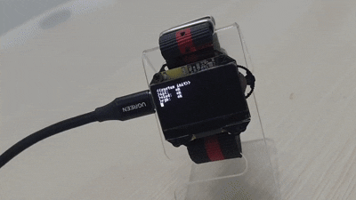
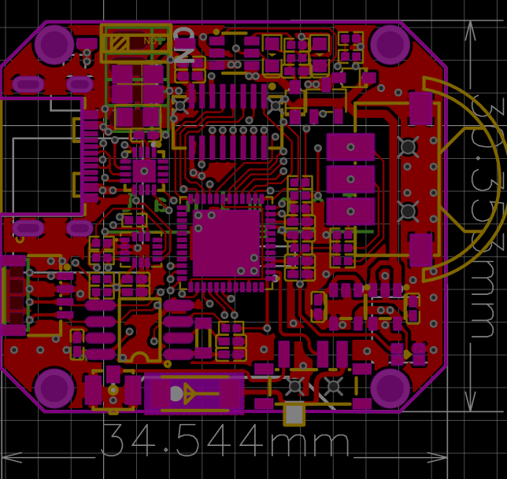
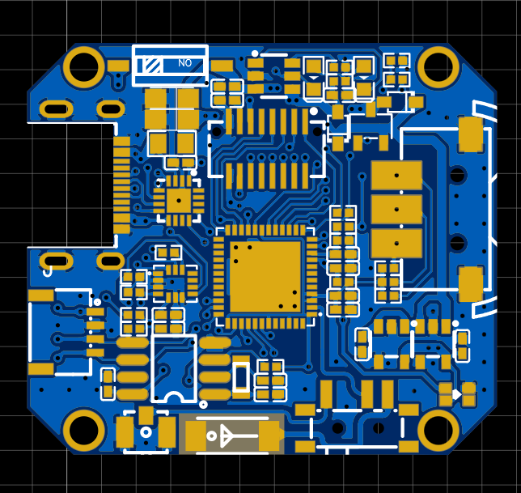
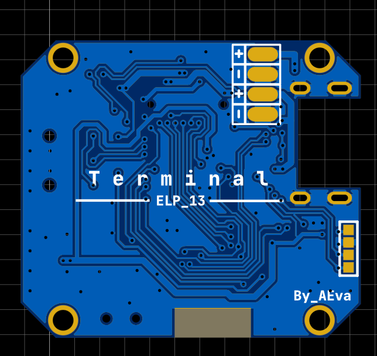
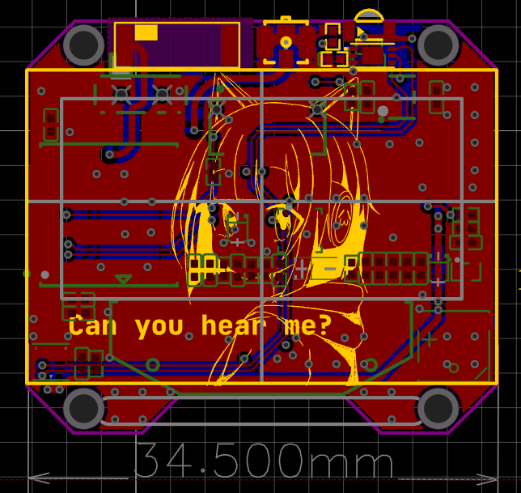
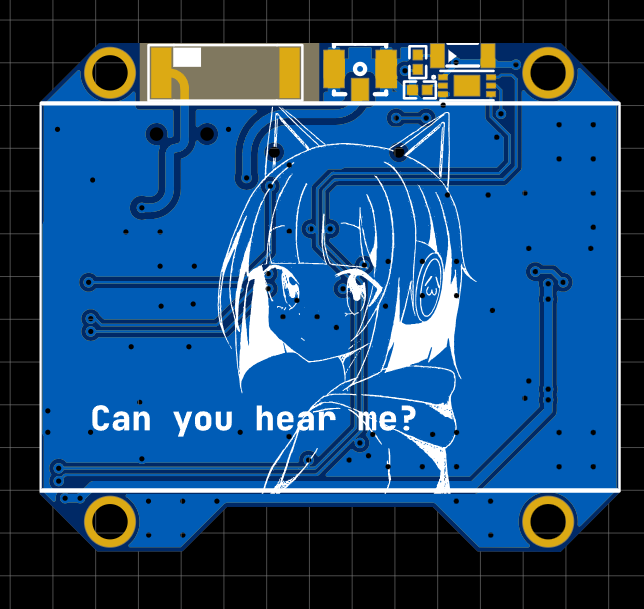
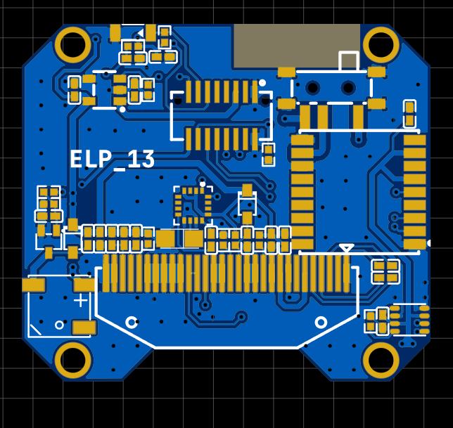

<h1 align="center">Terminal</h1>

    
    ELP-13 FROM OXTRE..

## Overview

A oled smart watch

 

 

## Features

This project aims to use a similar `CLI` interface on embedded devices that programmers love

- control borad
  1. RGB : ws2812b
  2. POWER : TP4059 + TPS78233
  3. MCU : ESP32-PICO-D4
  4. RTC : PCF8563T
  5. ACCE : LSM6DS3TR
  6. key : Wheel Switch
  7. BAT : 303030 280ma

- screen borad
  1. OLED : 1.3 ssd1306
  2. SENSORS : BH1750+BME280+QMC5883L
  3. BUZZER : MLT-5020
  4. GPS : GP-02
  5. Infrared : IR12+PT12

## Program

Serial debugging and programming of ESP32 using `typec` interface (built-in CP2102)

Some libraries may not be found on the Arduino library manager, you can get these libraries through the following methods:  

[Evlk-Terminal-Library](https://github.com/EVOLINK-TEAM/Evlk-Terminal-Library)  
[Evlk-Shell-Library](https://github.com/EVOLINK-TEAM/Evlk-Shell-Library)  

## Use

Press the button or shake your arm to display the time

## And More?

 
 
 

 
 
 

